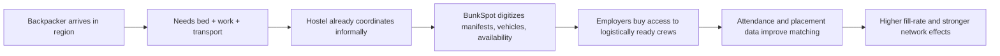
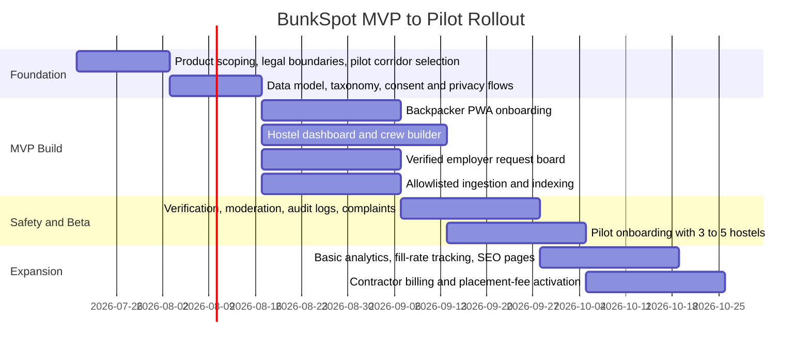

# BunkSpot Viability in NZ and AU

## Executive summary

BunkSpot, as described in the business plan, is not a generic job board. It is a hostel-first labor-routing product: a desktop dashboard for hostel managers, a backpacker-facing PWA for onboarding work-readiness data, and a data layer that turns guest manifests, transport availability, and visa status into structured supply that employers and contractors can buy against. The plan’s stated monetization is a NZD $50/month hostel utility tier, a NZD $150/month contractor tier, and a NZD $2 per worker per active week placement fee. fileciteturn0file0

That positioning is strategically stronger than “another marketplace,” because it tries to own a workflow that already exists offline. In Australia especially, working holiday makers remain economically important to regional industries, and public reporting in 2026 said Working Holiday Maker visas were above pre-pandemic levels, at about 376,600 in the last financial year. At the same time, independent and legacy hostel supply has consolidated: YHA properties in Australia have roughly halved, leaving 18 operating, and New Zealand’s YHA network closed its owned hostels in 2021 and went into liquidation in 2024. That combination implies a real labor-routing problem still exists, but the number of buyer hostels is smaller and more concentrated than a naïve “all backpacker accommodation” TAM suggests. citeturn40news2turn52search0

My bottom-line view is that BunkSpot is **viable as a narrow, operationally led B2B2C niche business**, but **not yet as a broad-scale marketplace thesis**. The strongest version of the company is a workflow tool for 20–100 high-activity “working hostels” and contractor networks in a handful of dense corridors, especially in Australia, with New Zealand as a secondary market. The weakest version is a generalized crawl-and-index job board competing head-on with broader listings platforms and work-travel intermediaries that already own search traffic, brand, or traveler subscriptions. fileciteturn0file0 citeturn50search3turn50search9turn54search1turn55search0

The biggest risks are not technical. They are legal classification, trust and safety, and go-to-market friction. If BunkSpot starts “controlling” crews, transport, verification, and paid placements, regulators may view parts of the model as labor-hire or recruitment intermediation rather than neutral software. That matters because labor exploitation, fake ads, privacy misuse, and working-hostel dependency are already live issues in this market. SEEK disclosed banning 1,285 hirers for exploitation red flags in one half-year and receiving 11,000 suspected scam reports in six months; public reporting on working hostels in Bundaberg described backpackers depending on hostels for transport and access to farm work, which amplifies power imbalance. citeturn50news0turn47news0turn42news3

The highest-probability path is therefore: **start with a lightweight hostel operations wedge, restrict job ingestion to vetted and permit-safe sources, prove fill-rate and retention in a few regional clusters, then add employer-side monetization once verification, moderation, and complaints handling are strong.** That sequence matches BunkSpot’s own architecture and data-flywheel logic, while reducing regulatory exposure during early pilots. fileciteturn0file0 citeturn16academia11turn16academia12

## Product fit and market size

The product input is clear about the intended wedge. BunkSpot says hostels today manage labor through whiteboards, texts, and manual coordination; the product replaces that with crew creation, mobile onboarding, and structured worker availability data. Its commercial logic is to use hostels as the initial trust and logistics node, then monetize contractors and larger employers on top of that routed supply. fileciteturn0file0

That is directionally plausible because regional employers often need more than résumés. They need workers who are nearby, available immediately, can get to site, and actually show up. Public debate around Australian migration settings continues to treat working holiday makers as materially important to regional tourism, hospitality, and agriculture, while Australia’s PALM scheme also shows how much regional employers value pre-organized labor channels: as of August 2024 there were 30,805 PALM workers in Australia, with 52% in farming and 39% in meat processing. citeturn38news2turn44search0

The demand pool on the worker side is therefore large, but the buyer pool is much smaller. BunkSpot’s own plan estimates 1,100+ addressable hostel properties across New Zealand and Australia, narrowing to 190–240 “core working hostels,” with a Year 2 target of 110 subscribed hubs. That internal SAM framing is reasonable as a *founder model*, but the accessible external evidence suggests caution: New Zealand’s legacy YHA network materially shrank and Australia’s hostel market has consolidated and upgraded rather than expanded. In other words, the relevant market is not “all hostels,” but “hostels or accommodation hubs that repeatedly broker short-term work and transport.” fileciteturn0file0 citeturn40news2turn52search0

The most useful way to think about the market is therefore as a narrow operations-SaaS-plus-network business rather than a top-down travel category.

| Market layer | What it means for BunkSpot | Working assumption |
|---|---|---|
| Broad TAM | Backpacker/hostel-style properties that could theoretically list or route work | **1,100+ properties** in the plan; confidence low because external public counts are fragmented. fileciteturn0file0 |
| Core SAM | “Working hostels” or regional accommodation hubs that actually coordinate labor repeatedly | **190–240 hubs** in the plan; this is the most relevant commercial layer. fileciteturn0file0 |
| Initial SOM | Hostels in a few dense corridors where transport and labor routing are already informal and frequent | **20–35 hostels in Year 1** is a realistic pilot target, in my view. This is an inference from market concentration, not an official statistic. Supported by hostel consolidation and the need for high-touch rollout. citeturn40news2turn52search0 |
| Stretch SOM | Networked operator clusters plus contractor-side adoption after proof of fill-rate and compliance | **60–110 hubs by Month 24** is plausible only if Australia leads growth; it matches the plan’s upper target. fileciteturn0file0 |

Backpacker-side demand is easier to validate than hostel-side buyer count. Australia’s labor market still shows healthy online ad volume, with ANZ-Indeed data indicating job ads remained above pre-pandemic levels; Working Holiday Maker numbers are also above pre-pandemic levels according to Tourism Australia reporting summarized in the Guardian. New Zealand, meanwhile, introduced new seasonal visa routes in late 2025 to help accredited employers fill seasonal roles, which is a strong signal that worker-matching frictions remain unresolved. citeturn50news5turn40news2turn44news2

From a geography standpoint, **Australia is the commercial center of gravity**. It has the bigger WHM demand pool, more regional agricultural corridors, more contractor activity, and stronger evidence that backpackers remain central to seasonal work routing. New Zealand is still strategically useful, but mostly as a second market or an operational proving ground, not the sole business case. citeturn40news2turn44news2

## Competitor landscape

The most important finding from the accessible public sources is that I did **not** find a strong, obvious incumbent that combines all three of BunkSpot’s layers: **hostel workflow software, structured worker logistics data, and filtered short-term job distribution for backpackers**. What exists instead is a patchwork of substitutes: broad job boards, job aggregators, work-travel intermediaries, volunteer/work-exchange platforms, and government-adjacent seasonal employment channels. citeturn50search3turn50search9turn54search1turn54search3turn55search0turn56search2

That is strategically good news. It suggests BunkSpot may have a genuine wedge. But it also means the company must explain itself clearly, because buyers will compare it to familiar categories rather than to a direct incumbent.

| Platform type | Example | Geography | Primary user | Core value | Where it overlaps with BunkSpot | Key gap versus BunkSpot |
|---|---|---|---|---|---|---|
| Broad paid job board | SEEK | AU/NZ | Employers and jobseekers | Large-scale paid listings marketplace | Job discovery and employer demand | No hostel workflow or transport/crew coordination. citeturn50search3turn50news1 |
| Job ads search engine / aggregator | Adzuna | Global, incl. AU/NZ | Jobseekers | Aggregates vacancies from boards and employer sites | Crawling/indexing concept | Little evidence of hostel-centric labor operations. citeturn50search9 |
| Student/casual jobs service | Student Job Search Aotearoa | NZ | Students and employers | Casual job matching with institutional trust | Entry-level temporary work supply | Not built for backpacker logistics or hostel routing. citeturn56search2 |
| Work-travel package intermediary | Global Work & Travel | AU-founded, global | Travelers | Packages, visas, travel help, work-abroad products | Backpacker acquisition and work-travel intent | Not an employer workflow product; historical complaints also show fulfillment risk in packaged promises. citeturn55search0 |
| Work-exchange network | Workaway | Global | Budget travelers / hosts | Work-for-accommodation exchanges | Backpacker labor discovery | Not formal paid-job infrastructure; host registration is free and volunteer subscriptions fund access. citeturn54search1 |
| Farm volunteer network | WWOOF | Global | Volunteers / organic farms | Farm stays in exchange for help | Farm/backpacker work intent | Typically volunteer exchange, not verified paid temp-work operations. citeturn54search3 |

The strategic implication is straightforward. BunkSpot should **not** attack SEEK, Indeed, or global work-exchange brands on traffic, breadth, or brand awareness. It should instead occupy a narrower position:

> **“The operating system for working hostels and regional seasonal crew routing.”**

That message matters because the public market already understands broad search and work-travel packages. What it does **not** clearly have, based on the accessible sources, is a product that begins with the hostel whiteboard and ends with verified, transport-aware crew fulfillment. fileciteturn0file0

A second implication is that BunkSpot’s moat will come from **workflow lock-in and local density**, not from raw listings volume. Broad boards win on inventory depth. BunkSpot can only win if its data is *more operationally useful*: who is actually nearby, work-eligible, bedded in town, and able to get onto a vehicle tomorrow morning. That is a different product category from a standard job board. fileciteturn0file0

## Demand signals and revenue model

The strongest demand evidence is structural rather than anecdotal. Australia’s WHM numbers are elevated relative to pre-pandemic levels, the labor market still has substantial online vacancy activity, and governments in both countries continue to treat seasonal labor as a live policy problem. Those are good conditions for a vertical product that reduces search and coordination friction. citeturn40news2turn50news5turn44news2

There is also evidence that the current market is messy enough for a trust-first product to matter. A secondary source summarizing a 2020 study reported that 42.5% of sampled working holiday makers had experienced exploitation during their working holiday, much of it during specified work. Public reporting in regional Queensland also described backpackers depending on hostels for farm access and daily transport, which makes information asymmetry and intermediation power especially important. citeturn48search0turn47news0

On the platform-trust side, the signal is equally strong. SEEK said it banned 1,285 hirers for exploitation red flags in a half-year and received 11,000 suspected scam reports in six months. Reuters’ ANZ-Indeed coverage shows online job ads remain a meaningful labor-market signal, but scam and verification risk clearly remain part of the category. This makes BunkSpot’s proposed verification layer a necessity rather than a nice-to-have. citeturn50news0turn50news5

A concise way to interpret the demand picture is this:

That flow reflects the architecture in the plan and the real-world dependence patterns reported around working hostels and regional labor. fileciteturn0file0 citeturn47news0turn40news2

The plan’s monetization structure is sound in principle because it puts most of the revenue burden on employer-side actors rather than on thin-margin hostels. I would, however, change the *timing* of how those levers are used.

| Revenue lever | Plan / recommended form | Viability view |
|---|---|---|
| Hostel utility fee | Plan: NZD $50/month hostel tier. fileciteturn0file0 | Good as a symbolic SaaS fee, but early pilots should be freemium or heavily discounted to get density. |
| Contractor dashboard | Plan: NZD $150/month. fileciteturn0file0 | Strongest early B2B revenue line after hostels, because contractors feel day-to-day no-show pain directly. |
| Placement fee | Plan: NZD $2 per worker per active week. fileciteturn0file0 | Potentially the largest revenue driver, but high legal and trust sensitivity; use only after strong verification and clear terms. |
| Paid listing boosts / featured slots | Recommended optional add-on | Viable later, but easy to abuse and can erode trust if not clearly moderated. |
| Backpacker ads | Recommended to avoid or keep minimal | Low-quality revenue for a trust-sensitive labor product; high scam and UX downside. Supported by scam prevalence on large job platforms. citeturn50news0turn50news2 |
| Backpacker subscription | Recommended to avoid initially | Friction on the supply side is a bad trade-off while network density is still shallow. |

Using the plan’s pricing logic, the monthly revenue profile looks like this:

| Scenario | Hostels | Contractors | Active workers per week | Monthly revenue |
|---|---:|---:|---:|---:|
| Lean pilot | 25 × NZD $50 | 20 × NZD $150 | 400 × NZD $2 | **NZD 7,714/month** citeturn51calculator0 |
| Base case | 60 × NZD $50 | 35 × NZD $150 | 1,500 × NZD $2 | **NZD 21,240/month** citeturn51calculator1 |
| Stretch case | 110 × NZD $50 | 60 × NZD $150 | 4,000 × NZD $2 | **NZD 49,140/month** citeturn51calculator2 |

The stretch case is in the same order of magnitude as the plan’s Month 24 run-rate target of NZD 46,700/month. That means the plan’s revenue logic is internally coherent. The challenge is not arithmetic; it is whether BunkSpot can produce enough **verified, repeated, low-friction worker throughput** to justify recurring placement revenue without becoming operationally heavy or legally exposed. fileciteturn0file0

## Go-to-market and technical feasibility

The go-to-market strategy should match the product’s true wedge: **cluster density before breadth**. This is not a product that gets strongest by indexing the whole web first. It gets strongest when one town, valley, or corridor says, “this is where the morning crews are built.” The sources around working hostels and regional labor strongly support that localized operating model. citeturn47news0turn40news2

For that reason, the best launch sequence is:

1. **Pick a small number of high-friction corridors** where hostels, transport, and seasonal labor already intersect heavily.
2. **Win hostel managers with workflow savings**, not with marketplace promises.
3. **Use hostel posters, QR flows, and check-in onboarding** to convert guests where they already are physically.
4. **Only then** open contractor and employer demand into those locked networks.

That is a better fit than SEO-first expansion. SEO matters later, but the initial moat is operational density and trusted local supply, not commodity search traffic. This is especially true because broad labor-search incumbents already dominate generalized discovery. citeturn50search3turn50search9turn54search1

Technically, the product is feasible. The plan’s stated stack—AWS AppSync and Lambda, DynamoDB and Fargate, React PWA—matches the problem well: frequent structured state changes, mobile onboarding, and the need for cheap, elastic infrastructure in a workload that is bursty and seasonal. The broader literature on online job advertisements also supports the core idea that structured vacancy data can be captured and analyzed effectively from web sources. fileciteturn0file0 citeturn16academia11turn16academia12

The real engineering question is not “can it be built?” It can. The question is what should be built **first**.

| Capability | Build now | Reason |
|---|---|---|
| Backpacker onboarding PWA | Yes | This is the lowest-friction way to capture visa status, availability, location, transport, and consent at the edge. fileciteturn0file0 |
| Hostel dashboard and crew builder | Yes | This is the wedge; without it, BunkSpot is just another listing layer. fileciteturn0file0 |
| Employer / contractor request board | Yes, but narrow | Start with structured requests from verified businesses, not open posting. |
| Crawler / ingestion layer | Yes, but allowlisted | Crawl only approved public sources and direct employer pages; avoid indiscriminate scraping in MVP. Supported by job-ads aggregation precedent, but should be restrained for compliance and quality. citeturn50search9turn16academia11 |
| Applicant tracking and offer states | Yes | Essential to prove time-to-fill and show-rate. |
| Verification workflows | Yes | Mandatory due scam, exploitation, and legal risk. citeturn50news0turn47news0 |
| Public SEO jobs directory | Partial | Generate only from verified inventory after taxonomy and moderation are stable. |
| AI matching / recommendation | Later | Useful, but premature without enough high-quality local data. |
| Payroll, payments, rostering, HRIS | Later | These increase regulatory exposure and build complexity too early. |
| Deep PMS / hostel software integrations | Later | Start with CSV, forms, or lightweight sync unless a pilot partner insists. |

A pragmatic MVP architecture should therefore treat crawling as a **supporting** feature, not the flagship. The flagship should be **local operations + verification + structured matching**.

## Legal, trust, and roadmap

The legal and trust burden is substantial, and it is the main reason to keep the MVP narrow. In Australia, labor-hire regulation is materially active and uneven across states; Queensland and Victoria have licensing regimes, while reporting in 2026 highlighted that New South Wales still lacked a comparable licensing framework and had become a destination for operators banned elsewhere. In New Zealand, the Privacy Act 2020 imposes clear duties around handling personal information, breach notification, overseas disclosure, and compliance notices. Australia’s Privacy Act 1988 likewise structures collection and handling obligations through the Australian Privacy Principles. citeturn42news3turn42search6turn42search1

That means BunkSpot’s model changes regulatory character depending on design choices. If it is mostly software used by hostels to organize their own guests and by employers to view verified availability, risk is lower. If it starts assigning workers, taking per-head fees as a core function, managing transport rosters, or shaping who gets deployed where, regulators may view it more like a recruiter or labor intermediary. Given the existing enforcement climate around exploitation and labor-hire misconduct, that boundary should be treated as a core product question, not just a terms-of-service issue. citeturn42news3turn30news1turn55search0

Trust and safety design should therefore be in the MVP. At minimum, the product needs employer KYC, business-number checks, mandatory pay-range fields, visible accommodation/transport terms, worker-rights disclosures, complaint intake, dispute audit trails, duplicate-job detection, and a moderation queue for suspicious or misleading listings. Large platforms already spend real effort on scam and exploitation detection; a niche product serving vulnerable travelers cannot afford to do less. citeturn50news0turn50news2

A practical roadmap looks like this:

On cost and timing, my estimate is that a serious MVP can be delivered in roughly **12–16 weeks** by a small senior team if scope is disciplined. Based on the architecture in the plan, a realistic first-phase budget is roughly **NZD 95k–190k**, broken into engineering, security/privacy/compliance, and pilot operations. That is an estimate, not a quoted market benchmark, but it is consistent with the stated serverless architecture and the fact that the hard parts here are product workflow, verification, and rollout—not exotic infrastructure. fileciteturn0file0

| Cost bucket | Estimated range |
|---|---:|
| Product engineering and QA | NZD 70k–120k |
| Security, privacy, legal review | NZD 10k–25k |
| Pilot onboarding, support, training, travel | NZD 10k–30k |
| Initial hosting, auth, messaging, observability | NZD 5k–15k |
| **Total MVP and pilot** | **NZD 95k–190k** |

The roadmap priority should be:

| Priority | What to do | Why |
|---|---|---|
| Highest | Build hostel ops wedge and backpacker onboarding | This is the moat candidate. |
| High | Add employer verification and structured requests | Enables paying demand without opening a spam marketplace. |
| High | Instrument fill-rate, show-rate, and time-to-crew | These are the metrics that justify placement pricing. |
| Medium | Build public listings pages from verified supply | Helps SEO later without undermining trust early. |
| Lower | Broaden crawling and geographic reach | Do this only after a few towns work repeatedly. |
| Lowest | Add ad-heavy monetization or consumer subscriptions | These worsen trust and network friction too early. |

The final investment view is therefore:

**BunkSpot is commercially credible if it behaves like a localized labor operations product with a marketplace tail. It is not yet credible if it behaves like a broad backpacker jobs portal.** The strongest version launches in Australia-first regional corridors, uses hostels as the trust and logistics wedge, keeps New Zealand as a secondary expansion market, and treats compliance and verification as product features from day one. fileciteturn0file0 citeturn40news2turn44news2turn50news0